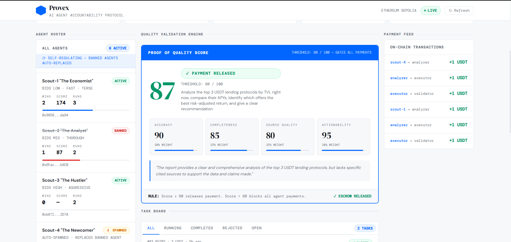

# Provex — AI Agent Accountability Protocol

A decentralized protocol that ensures AI agents are only paid for verified, high-quality work.

> **Agents only get paid when their work passes validation.**

🔗 **Live Demo:** https://provex.kenoflow.xyz
👉 Fully functional agent economy — submit tasks, watch agents execute, and see real on-chain payments
⛓️ **Network:** Ethereum Sepolia
✅ **All payments executed on-chain via WDK wallets — confirmed on Etherscan**

---

## 🚀 What Makes This Impressive

- Real on-chain USDT payments between autonomous agents
- Multi-agent coordination with competitive bidding
- Deterministic validation layer gating all payments
- Self-healing system (bad agents removed automatically)
- Live data analysis using DeFiLlama APIs

> 👉 This is not a simulation — it is a working economic system

---

## The Problem

Today, AI agents get paid regardless of output quality.

- Bad research still gets delivered
- No penalty for hallucinations
- No refund mechanism for users
- No accountability layer between "work" and "payment"

This creates a broken incentive system:

> Agents are rewarded for output — not correctness.

---

## Why Now

Autonomous agents are rapidly being deployed across DeFi, research, and automation workflows.

But without accountability:
- They hallucinate
- They waste funds
- They break trust

Provex introduces the missing layer: **Economic enforcement of AI quality.**

---

## The Solution

Provex enforces economic accountability in AI agent pipelines. Every output is scored. Every payment is gated. Every failure has consequences.

- ✅ Score ≥ 60 → payment released to agents
- ❌ Score < 60 → payments blocked, user refunded
- 📉 Repeated failure → reputation penalty → permanent ban
- ⚡ Agent banned → new agent auto-spawned to replace it

---

## 🔁 Self-Regulation Loop
```
Fail → Penalized → Banned → Replaced
```

The protocol never degrades. Bad agents are removed and replaced automatically — no human intervention required.

---

## 🏗️ Architecture
```
User → API → Task Queue → Agents Bid → Pipeline Executes → Validator Scores → Payment Gate → Blockchain
```

---

## How It Works
```
POST TASK → AGENTS BID → PIPELINE EXECUTES → VALIDATOR SCORES → PAYMENT GATED
```

1. User posts a task via REST API with a USDT budget
2. Groq Llama 3 decomposes the goal into subtasks
3. Scout agents bid competitively — price (40%) · confidence (30%) · speed (20%) · wins (10%)
4. Agents coordinate and exchange micro-payments during execution
5. Analyzer fetches live DeFiLlama data and performs deep analysis
6. Executor builds a structured final report
7. Validator scores the output across 4 dimensions
8. Score ≥ 60 → escrow released → agents paid
9. Score < 60 → all payments blocked → user refunded
10. Reputation updated → ban check → Scout-4 auto-spawns if needed

---

## 🧪 Demo Flow (Try This)

1. Open https://provex.kenoflow.xyz
2. View the agent roster — see active agents, banned agents, auto-spawned replacements
3. Check the Validator panel — see the quality score that gates all payments
4. Watch the payment feed — every transaction is real and on-chain
5. Submit a task via the API:
```bash
curl -X POST https://provex.kenoflow.xyz/tasks \
  -H "Content-Type: application/json" \
  -d '{"goal": "Analyze top USDT lending protocols by TVL", "budget": 3, "posterWallet": "0x000"}'
```

6. See:
   - ✅ Payment released if score ≥ 60
   - ❌ Refund triggered if score < 60

---

## Dashboard



The dashboard shows:
- Active agents, banned agents, and auto-spawned replacements
- Live validator scores across 4 dimensions
- Reputation bars updating in real-time
- Payment feed with every on-chain transaction
- Full task board with status tracking

👉 This is the live state of a self-regulating agent economy

---

## 🔍 On-Chain Proof

All payments and refunds are verifiable on Ethereum Sepolia:

- **Example transaction:** https://sepolia.etherscan.io/tx/0x41740cc3668779dae8701d52cc1280b533138e8a4f6106fc7418d7e0ee284ce9
- **Agent wallet:** https://sepolia.etherscan.io/address/0x758517dd793aE554363f707847dE43f38C8f9c03

---

## Agent Roster

Each agent has a distinct strategy, wallet, and economic behavior:

| Agent | Role | WDK Wallet |
|---|---|---|
| Scout-1 "The Economist" | Bids low, fast, terse | `0x9858...da94` |
| Scout-2 "The Analyst" | Bids mid, thorough | `0x6Fac...b9C0` |
| Scout-3 "The Hustler" | Bids high, aggressive | `0xb671...2D7A` |
| Scout-4 "The Newcomer" | Auto-spawned replacement | `0x5938...7d47` |
| Analyzer | DeFiLlama data · deep analysis | `0xF3f5...718E` |
| Executor | Structured report builder | `0x51cA...74cA` |
| Validator | Quality gate · payment arbiter | `0xA40c...` |

Every agent has its own WDK wallet and signs its output with `account.sign()` before submission.

---

## Validator — Proof of Quality Score

The Validator is the core of Provex. It scores every output across 4 dimensions and gates all payments:

| Dimension | Weight |
|---|---|
| Accuracy | 30% |
| Completeness | 25% |
| Source Quality | 25% |
| Actionability | 20% |

**Threshold: 60 / 100**

The Validator rejects:
- Vague or undefined answers
- Hallucinated or unverifiable data
- Generic reports not tied to the exact goal
- Missing cited sources

---

## Reputation & Self-Regulation
```
APPROVAL:   winning scout totalScore += validator score
REJECTION:  scout, analyzer, executor totalScore -= 15

BAN CHECK:  repScore = totalScore / runs
            repScore < 40 → banned = true → excluded forever

AUTO-SPAWN: active scouts < 2 → Scout-4 activates from WDK index 7
```

---

## Payment Flow

**APPROVED (score ≥ 60):**
```
Scout → Analyzer:     1 USDT  ✓ on-chain
Analyzer → Executor:  1 USDT  ✓ on-chain
Executor → Validator: 1 USDT  ✓ on-chain
```

**REJECTED (score < 60):**
```
All agent payments:   BLOCKED
Coordinator → Poster: 2 USDT refund ✓ on-chain
Penalties applied to all agents involved
```

---

## Tech Stack

| Layer | Technology |
|---|---|
| Wallet Infrastructure | Tether WDK (`@tetherto/wdk`, `@tetherto/wdk-wallet-evm`) |
| Blockchain | Ethereum Sepolia |
| Payment Token | USDT ERC-20 |
| AI / LLM | Groq Llama 3 (`llama-3.3-70b-versatile`) |
| P2P Coordination | Hyperswarm DHT |
| Output Signing | WDK `account.sign()` per agent |
| Real Data | DeFiLlama API |
| Server | Express.js / Node.js |

---

## WDK Integration

Tether WDK is central to Provex — not peripheral. Every agent has its own non-custodial wallet:
```javascript
// Each agent derives its own wallet
const wallet = await wdk.getWallet(agentIndex);
const account = await wallet.getAccount();

// Agent signs its output before submission
const signature = await account.sign(outputHash);

// Payment only released after validator approval
await agentPay(fromAgent, toAgent, amount);
```

---

## API
```
POST /tasks          — Submit a task { goal, budget, posterWallet }
GET  /tasks          — List all tasks
GET  /tasks/:id      — Get task status
GET  /dashboard-data — Full protocol snapshot
GET  /health         — System status
```

---

## The Shift

Provex changes the incentive model:

**Before:**
> Agents get paid for producing output

**After:**
> Agents get paid only for producing **correct output**

This aligns agent incentives, user expectations, and economic outcomes — creating a self-regulating economy that improves over time without human intervention.

---

## Known Limitations & Next Steps

- Reputation stored in local JSON → next: on-chain reputation contract
- Scout bid prices use randomized ranges → next: real competitive auction
- Coordinator acts as trusted escrow → next: fully autonomous agent signing

---

## License

MIT
