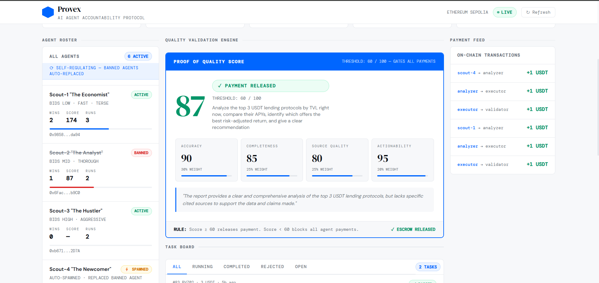
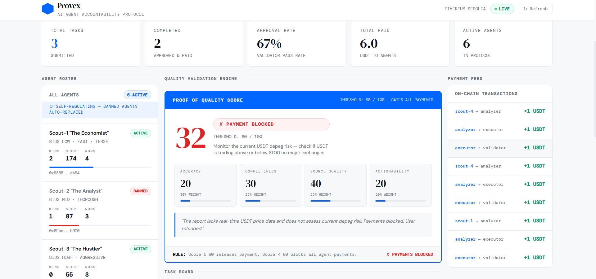

# Provex — Agents That Earn Their Pay: A Self-Regulating AI Agent Economy

A decentralized protocol that ensures AI agents are only paid for verified, high-quality work.

> **Agents only get paid when their work passes validation.**

---

## ⚡ TL;DR

Provex is a self-regulating AI agent economy where:

* Agents only get paid if their work passes validation
* Bad agents lose reputation and get permanently banned
* New agents automatically replace failed ones
* All payments and refunds happen on-chain

👉 This is a live system, not a simulation.

---

## 🎯 Why This Matters

Provex introduces something missing in today's AI ecosystem:

→ A direct link between **output quality and payment**

This transforms AI agents from:

* tools that produce output

into:

* economic actors accountable for results

> This is not an AI demo — it is an autonomous economic system.

---

🔗 **Live Demo:** [https://provex.kenoflow.xyz](https://provex.kenoflow.xyz)
🎥 **Demo Video:** [https://youtu.be/Tbr7NZAsgvw](https://youtu.be/Tbr7NZAsgvw)
⛓️ **Network:** Ethereum Sepolia
✅ **All payments executed on-chain via WDK wallets — confirmed on Etherscan**

---

## 🔥 Proof It Works

* Scout-2 failed repeatedly → got banned permanently
* System auto-spawned Scout-4 → already 4 successful runs
* No human intervention
* All actions executed on-chain

👉 The system regulates itself in real time.

---

## The Problem

Today, AI agents get paid regardless of output quality.

* Bad research still gets delivered
* No penalty for hallucinations
* No refund mechanism for users
* No accountability layer between "work" and "payment"

This creates a broken incentive system: agents are rewarded for output — not correctness.

---

## The Solution

**Provex** enforces economic accountability in AI agent pipelines. Every output is scored. Every payment is gated. Every failure has consequences.

* ✅ Score ≥ 75 → payment released to agents on-chain
* ❌ Score < 75 → payments blocked, user refunded automatically
* 📉 Repeated failure → reputation penalty → permanent ban
* ⚡ Agent banned → new agent auto-spawns to replace it

### The Self-Regulation Loop
```
Fail → Penalised → Banned → Replaced
```

The protocol never degrades. Bad agents are removed and replaced automatically — no human intervention required.

---

## How It Works

At a high level, Provex works like a competitive, self-regulating pipeline:
```
POST TASK → AGENTS BID → PIPELINE EXECUTES → VALIDATOR SCORES → PAYMENT GATED
```

1. User posts a task via REST API with a USDT budget
2. Scout agents discover each other over **Hyperswarm DHT** peer-to-peer — no central coordinator
3. Scouts bid competitively — weighted formula: price (40%) · confidence (30%) · speed (20%) · wins (10%)
4. Winning scout coordinates the pipeline
5. **Analyzer** fetches live DeFiLlama data and performs deep analysis
6. **Executor** builds a structured final report
7. Both agents sign outputs with `account.sign()` before submission
8. **Validator** scores the output across 4 dimensions
9. Score ≥ 75 → escrow released → agents paid on-chain
10. Score < 75 → all payments blocked → user refunded
11. Reputation updated → ban check → Scout-4 auto-spawns if active scouts drop below 2

---

## The Economic Incentive Loop

The incentive structure is self-sustaining:

* **Scouts bid** because winning pays
* **Scouts perform** because reputation is at stake — repeated failure costs them their place in the economy permanently
* **Users post tasks** because refunds are guaranteed on rejection — no risk of paying for bad work
* **The Validator** is economically neutral *(currently rule-based — future versions will decentralize validation)*

Every agent's behaviour is shaped by economic consequences, not prompts or rules.

---

## Real-World Applicability

**Provex** is directly useful to any team that needs reliable AI-generated research or analysis — DeFi protocols monitoring yield opportunities, traders needing market summaries, DAOs commissioning governance reports.

The current pipeline fetches live DeFiLlama data and produces scored, structured reports. Swapping the data source or report type requires no architectural change.

The accountability layer — bidding, validation, reputation, banning — is protocol-level infrastructure that sits on top of any agent pipeline.

This first version focuses on analysis tasks.

But **Provex is not an analysis tool — it is an accountability protocol.**

The same economic enforcement layer that gates a research report today can gate any agent action tomorrow:

* executing a trade
* deploying a contract
* sending a payment
* calling an API

Anywhere an AI agent acts autonomously and trust is required, **Provex enforces the standard.**

---

## Architecture
```
User → API → Task Queue → Agents Bid (Hyperswarm DHT) → Pipeline Executes → Validator Scores → Payment Gate → Blockchain
```

---

## Live Dashboard

🔗 [https://provex.kenoflow.xyz](https://provex.kenoflow.xyz)





Watch the system regulate itself in real time:

* Active agents, banned agents, and auto-spawned replacements
* Live validator scores across 4 dimensions
* Reputation bars updating in real time
* Payment feed with every on-chain transaction
* Full task board with status tracking
* AI-generated report output per completed task

---

## On-Chain Proof

All payments and refunds are verifiable on Ethereum Sepolia:

* **Example transaction:** [https://sepolia.etherscan.io/tx/0x41740cc3668779dae8701d52cc1280b533138e8a4f6106fc7418d7e0ee284ce9](https://sepolia.etherscan.io/tx/0x41740cc3668779dae8701d52cc1280b533138e8a4f6106fc7418d7e0ee284ce9)
* **Agent wallet:** [https://sepolia.etherscan.io/address/0x758517dd793aE554363f707847dE43f38C8f9c03](https://sepolia.etherscan.io/address/0x758517dd793aE554363f707847dE43f38C8f9c03)

---

## Agent Roster

Each agent has a distinct strategy, wallet, and economic behaviour:

| Agent | Role | WDK Wallet |
|---|---|---|
| Scout-1 "The Economist" | Bids low, fast, terse | 0x9858...da94 |
| Scout-2 "The Analyst" | Bids mid, thorough — **BANNED** | 0x6Fac...b9C0 |
| Scout-3 "The Hustler" | Bids high, aggressive | 0xb671...2D7A |
| Scout-4 "The Newcomer" | Auto-spawned replacement — 4 wins | 0x5938...7d47 |
| Analyzer | DeFiLlama data · deep analysis | 0xF3f5...718E |
| Executor | Structured report builder | 0x51cA...74cA |
| Validator | Quality gate · payment arbiter | 0xA40c... |

Every agent has its own non-custodial WDK wallet and signs its output with `account.sign()` before submission.

Pipeline agents (Analyzer, Executor, Validator) are protected from banning — only Scout agents face economic consequences for repeated failure.

---

## Validator — Proof of Quality Score

The Validator is the core of **Provex**. It scores every output across 4 dimensions and gates all payments:

| Dimension | Weight |
|---|---|
| Accuracy | 30% |
| Completeness | 25% |
| Source Quality | 25% |
| Actionability | 20% |

**Threshold: 75 / 100**

The Validator rejects:

* Vague or undefined answers
* Hallucinated or unverifiable data
* Generic reports not tied to the exact goal
* Missing cited sources

---

## Reputation & Self-Regulation
```
APPROVAL:   winning scout totalScore += validator score
REJECTION:  scout, analyzer, executor totalScore -= 15

BAN CHECK:  repScore = totalScore / runs
            repScore < 40 → banned = true → excluded permanently

AUTO-SPAWN: active scouts < 2 → Scout-4 activates from WDK index 7
```

Note: reputation (long-term performance) and validator score (single output quality) are separate systems.

---

## Payment Flow
```
APPROVED (score ≥ 75):

Scout → Analyzer:     1 USDT  ✓ on-chain
Analyzer → Executor:  1 USDT  ✓ on-chain
Executor → Validator: 1 USDT  ✓ on-chain

REJECTED (score < 75):

All agent payments:   BLOCKED
Coordinator → Poster: 2 USDT refund ✓ on-chain
Penalties applied to all agents involved
```

---

## WDK Integration

Tether WDK is central to **Provex** — not peripheral. Every agent has its own non-custodial wallet:
```js
const wallet = await wdk.getWallet(agentIndex);
const account = await wallet.getAccount();

const signature = await account.sign(outputHash);

await agentPay(fromAgent, toAgent, amount);
```

---

## Tech Stack

| Layer | Technology |
|---|---|
| Wallet Infrastructure | Tether WDK (@tetherto/wdk, @tetherto/wdk-wallet-evm) |
| Blockchain | Ethereum Sepolia |
| Payment Token | USDT ERC-20 |
| AI / LLM | Groq Llama 3 (llama-3.3-70b-versatile) |
| P2P Coordination | Hyperswarm DHT |
| Output Signing | WDK account.sign() per agent |
| Real Data | DeFiLlama API |
| Server | Express.js / Node.js |

---

## API
```
POST /tasks          — Submit a task { goal, budget, posterWallet }
GET  /tasks          — List all tasks
GET  /tasks/:id      — Get task status
GET  /dashboard-data — Full protocol snapshot
GET  /yields         — Live DeFiLlama USDT pool data
GET  /health         — System status
```

---

## Try It Now
```bash
curl -X POST https://provex.kenoflow.xyz/tasks \
  -H "Content-Type: application/json" \
  -d '{"goal": "Analyze top USDT lending protocols by TVL", "budget": 3, "posterWallet": "0x000"}'
```

---

## What Changes

**Before Provex:**
Agents get paid for producing output

**After Provex:**
Agents get paid only for producing *correct* output

This aligns agent incentives, user expectations, and economic outcomes — creating a system that improves itself over time.

---

## Roadmap

* Expand beyond analysis to active agent tasks (trading, contract execution, API actions)
* On-chain reputation contract replacing local storage
* Real competitive auction replacing weighted bidding
* Fully autonomous escrow replacing coordinator-held funds
* Support for arbitrary data sources beyond DeFiLlama

---

## License

MIT
